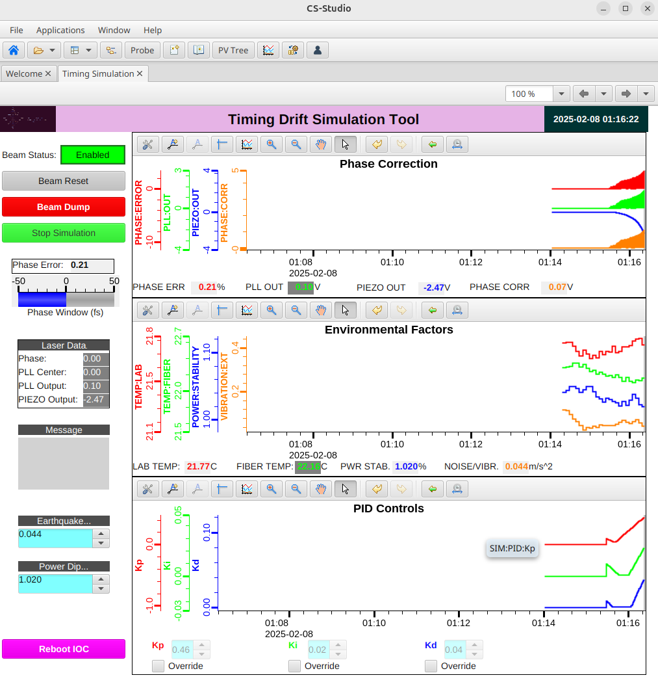
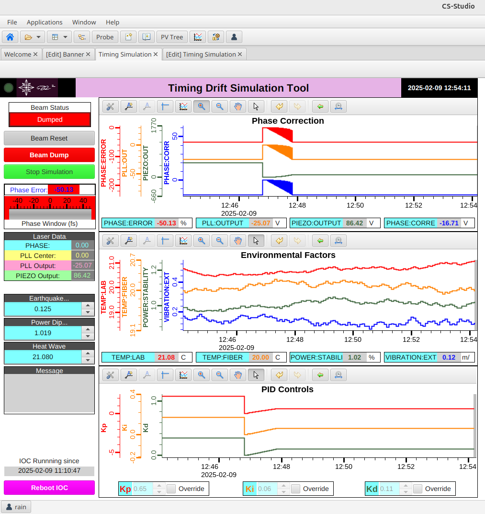
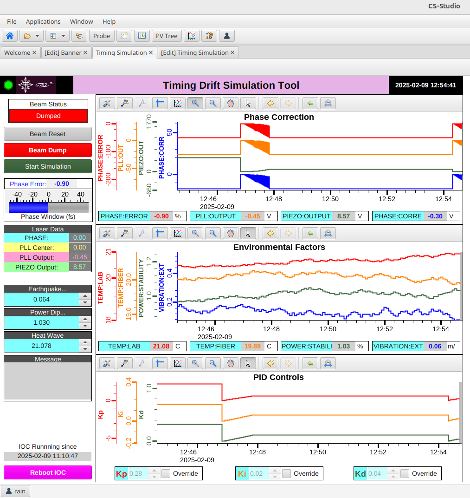

# Timing Drift Simulation Tool

## Overview
The **Timing Drift Simulation Tool** is an **EPICS-based** simulation designed to model and correct phase drift in a timing system. It uses **PID control** to stabilize phase errors introduced by environmental fluctuations, with an integrated **Phoebus GUI** for real-time monitoring and manual adjustments.

This tool provides:
- A **soft IOC** managing simulated phase drift, environmental conditions, and beam stability.
  - soft IOC runs in python without needing full EPICS build
- A **Phoebus GUI** for visualization and manual tuning.
- A **PID control loop** that dynamically adjusts gains to stabilize phase error.
- Override modes to allow manual adjustments to PID parameters.

## Features
✅ **Real-time simulation of phase drift**  
✅ **EPICS Soft IOC with dynamic PV updates**  
✅ **Fully integrated Phoebus GUI** for monitoring & control  
✅ **Adaptive PID loop** for automatic phase stabilization  
✅ **Manual override** of PID gains when needed  
✅ **Fun toys** for simulated Earthquakes and Power Dips  
✅ **Beam dump logic** triggered by excessive phase drift  

## Installation & Setup
### **1. Clone the Repository**
```bash
git clone https://github.com/Rainer1370/TimingSim.git
cd TimingSim
```

### **2. Set Up Virtual Environment (Recommended)**
```bash
python3 -m venv venv
source venv/bin/activate  # On Windows use 'venv\Scripts\activate'
```

### **3. Install Dependencies**
```bash
pip install -r requirements.txt
```
Ensure `pcaspy`, `pyepics`, `numpy`, and `simple-pid` are installed.

### **4. Start the EPICS Soft IOC**
```bash
python simScripts/iocs/iocPhaseDriftSim.py
```
This starts the **EPICS Soft IOC**, initializing all PVs and starting the simulation.

### **5. Start the PID Control Loop**
```bash
python simScripts/pid_control.py
```
This script applies the **PID corrections** to stabilize phase drift.

### **6. Launch the Phoebus GUI**
Open Phoebus and load the GUI file:
```bash
phoebus gui.bob
```

## Running the Simulation
1. **Start the IOC** (`iocPhaseDriftSim.py`)
2. **Start the PID Controller** (`pid_control.py`)
3. **Launch the GUI in Phoebus**
4. Click **Start Simulation** to begin the phase drift correction process.

## How the PID Control Works
- The **PID loop** adjusts the **Piezo Output** based on `SIM:PHASE:ERROR`
- The **Proportional (Kp), Integral (Ki), and Derivative (Kd) gains** dynamically adapt based on:
  - Phase error size
  - Piezo output activity
  - Detection of oscillations
- Gains are **auto-adjusted** unless set to **Override Mode**

## Environmental Factors & Beam Dump
- **Phase Drift** is affected by:
  - `SIM:TEMP:LAB`: Lab temperature fluctuations
  - `SIM:TEMP:FIBER`: Fiber temperature changes
  - `SIM:VIBRATION:EXT`: External vibration
  - `SIM:POWER:STABILITY`: Power stability
- If **phase error exceeds a critical threshold**, a **beam dump** is triggered.
- Clicking **Reset Beam** restores operation.

## How to Override PID Gains
1. **Enable Override Mode**:
   - Set `SIM:PID:Kp_MODE = 1`
   - Set `SIM:PID:Ki_MODE = 1`
   - Set `SIM:PID:Kd_MODE = 1`
2. **Manually adjust gains** using Phoebus or caput:
   ```bash
   caput SIM:PID:Kp 1.5
   caput SIM:PID:Ki 0.02
   caput SIM:PID:Kd 0.01
   ```
3. **Disable Override Mode** to return to auto-adjustment.

## GUI Screenshots
### **Live Simulation Running:**


### **Simulation Failure - Beam Dump Triggered:**


### **Phoebus GUI Interface:**


## Troubleshooting & FAQs
**Q: The simulation isn’t updating PV values.**  
✅ Ensure the **IOC is running** (`iocPhaseDriftSim.py`)

**Q: PID gains don’t update in Auto Mode.**  
✅ Check `SIM:PID:Kp_MODE`, `SIM:PID:Ki_MODE`, `SIM:PID:Kd_MODE` (should be `0` for Auto)

**Q: The beam dumps too frequently.**  
✅ Increase `SIM:PLL:RANGE` to allow more phase drift before dumping.

## Contributions & Future Work
This tool is actively being developed for more advanced **timing system corrections**. Contributions & suggestions are welcome!

---
🚀 **© 2025 Rob Rainer. All Rights Reserved.**
